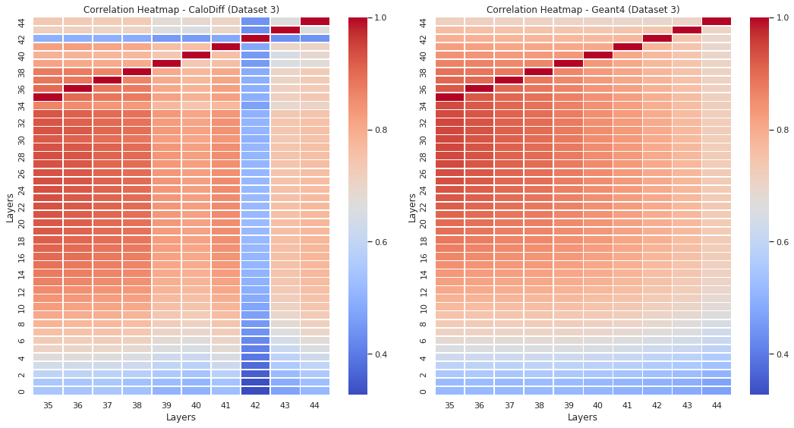

# Benchmarking Generative AI for Calorimeter Shower Simulation #

In this project we are comparing 4 different Generative AI models on Calorimeter Shower Simulation. This project is inspired by  CaloChallenge 2022[https://calochallenge.github.io/homepage/].


## Dataset

Dataset are similar as CaloChallenge

1. Dataset 1 available at https://zenodo.org/records/8099322
2. Dataset 2 available at https://zenodo.org/records/6366271
3. Dataset 3 available at https://zenodo.org/records/6366324
4. CaloFlow training dataset available at https://zenodo.org/records/5904188
5. CaloGAN dataset available at https://data.mendeley.com/datasets/pvn3xc3wy5/1


## Generative AI models

Here we compare 4 different Generative AI models.
They are 
1. CaloFlow on CaloGAN dataset (Normalizing Flow based model)https://gitlab.com/claudius-krause/caloflow
2. CaloDiffusion (Denoising Diffusion based model) https://github.com/OzAmram/CaloDiffusionPaper/tree/main
3. CaloScore (Score based model) https://github.com/ViniciusMikuni/CaloScoreV2/tree/main
4. CaloINN (Combination of VAE and Normalizing Flow) https://github.com/heidelberg-hepml/CaloINN/tree/calochallenge

In the following few sections we are discussing how to train and generate samples from these models in Rivanna.


## CaloDiffusion
The github page is missing the requirement.txt file. Our own requirement.txt for this model can be found in the CaloDiffusion folder of this project. 

To train, sample and plotting we follow the same commands that is mentioned in their own repository. 

An example sbatch file to generate sample for dataset 1 can also be found in CaloDiffusion folder in our repository.

## CaloScore 
1. See the link below (install TensorFlow and Keras together on one command-line). In the link, start with step2 since step1 (nvidia driver) is already installed on Rivanna nodes.
https://gretel.ai/blog/install-tensorflow-with-cuda-cdnn-and-gpu-support-in-4-easy-steps
2. Install the other packages horovod, matplotlib etc
3. ptxas error, see the link below 
https://stackoverflow.com/questions/66029426/anaconda-showing-this-error-cant-train-model-properly
4. If tensorrt is not installed, see the link below (tensorsort may not be needed)
https://docs.nvidia.com/deeplearning/tensorrt/install-guide/index.html


## CaloINN

The repository link has a requirement.txt file, we use the same requirement.txt file to create the environment. Other than that, We need to follow some additional steps to run. 

1. This code uses Latex with Matplotlib. Since we need to install TeXLive. TeXLive is available in the modules of Rivanna. Here is the link to do that https://www.rc.virginia.edu/userinfo/rivanna/software/texlive/#add-local-package

2. In this link it mentioned to create a folder like this ~/texmf/tex/latex and put your needed package from the https://ctan.org/

3. We found that we needed type1ec and type1cm , I copied the sty file of type1ec from  https://ctan.org/

4. We also copied the type1cm and base folder found in $EBROOTTEXLIVE/texmf-dist/tex/latex Into ~/texmf/tex/latex this directory.

5. After following these instructions in https://www.rc.virginia.edu/userinfo/rivanna/software/texlive/#add-local-package
You might get another error message saying FileNotFoundError: [Errno 2] No such file or directory: 'dvipng'
Since we also followed the instructions of this link https://hub.docker.com/r/uvarc/dvipng

6. Here in the link they mentioned “module load singularity” instead of singularity use 'module load apptainer'. 


Find an example sbatch file and the paper in CaloINN folder of this repository. 


## CaloFlow

The required environment packages can be found in the CaloFlow folder of this repository. 

 After that follow the same instructions found in their own git repository.

## To generate Layer-wise energy distribution for Dataset 1:
 Follow the jupyter notebook named generic_ds1.ipynb available in evaluation_codes directory.
 It has necessary instructions to follow. This will generate images like this.
 
## To generate the correlation graphs:

1. module load anaconda
2. conda activate caloflow_env
3. This is only applicable for Dataset 2 and Dataset 3
```
python correlate.py -i path_to_input_samples -r path_to_Geant4_samples -d '2' -m 'corr_dual' -n 'CaloDiffusion'
```
This will generate images like this.

4. Applicable for all dataset.
```
python correlate.py -i path_to_input_samples -r path_to_Geant4_samples -d '2' -m 'corr' -n 'CaloDiffusion'
```
This will generate images like this.
 

## To generate Energey grouped by layers
```
python evaluate_range.py --dataset_path <path-to-all-generated-files> --binning_file <path-to-binning.xml> --particle_type <photon-or-pion-or-electron> --dataset_num <2-or-3>
```

